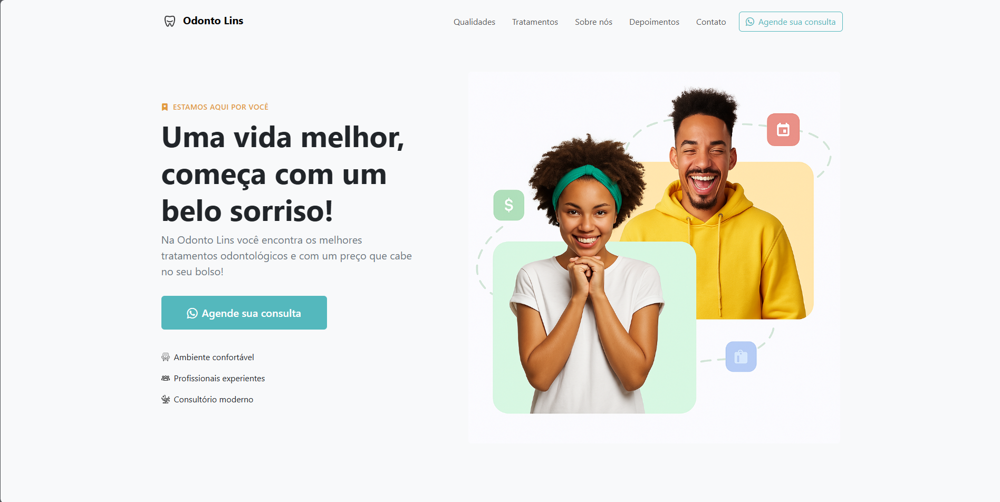

# Odonto Lins - Landing Page 🦷

Uma landing page moderna e responsiva, como parte do desafio técnico da empresa **Connecta Tecnologia**.
Projetada para a clínica fictícia **Odonto Lins**, com foco em conversão, performance e experiência do usuário.

## 📸 Demonstração



## 🚀 Tecnologias Utilizadas

- HTML5
- CSS3 + Variáveis customizadas
- Bootstrap 5
- JavaScript

## 💻 Como Rodar Localmente

### ▶️ Usando o Live Server (VS Code)

1. Instale a extensão [Live Server](https://marketplace.visualstudio.com/items?itemName=ritwickdey.LiveServer)
2. Clique com o botão direito no arquivo `index.html`
3. Selecione **"Open with Live Server"**
4. O navegador abrirá automaticamente em: `http://127.0.0.1:5500`

### 🧪 Ou manualmente

```bash
# Clone o repositório
git clone https://github.com/kerlenmelo/landing-page-odonto.git

# Acesse a pasta
cd landing-page-odonto

# Abra o arquivo index.html no navegador
```

## 🌍 Deploy

A landing page está publicada e disponível aqui:  
🔗 [https://kerlenmelo.github.io/landing-page-odonto](https://kerlenmelo.github.io/landing-page-odonto)

---

## ✨ Funcionalidades & Recursos

- ✅ Layout mobile-first
- 🎯 Animações suaves com JavaScript
- 💬 Carrossel automático de depoimentos
- 🎢 Scroll animado entre seções
- 📱 Botões de "Agende sua consulta" com redirecionamento para WhatsApp

---

## 📩 Contato

**Desenvolvido por Kerlen Melo**

- 📧 Email: [kerlen_1@hotmail.com](mailto:kerlen_1@hotmail.com)
- 🌐 LinkedIn: [linkedin.com/in/kerlenmelo](https://www.linkedin.com/in/kerlenmelo)
- 💻 GitHub: [github.com/kerlenmelo](https://github.com/kerlenmelo)
